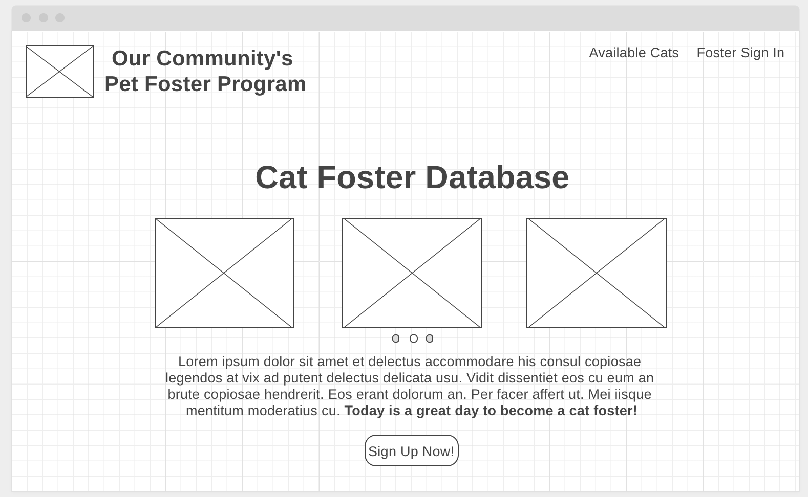
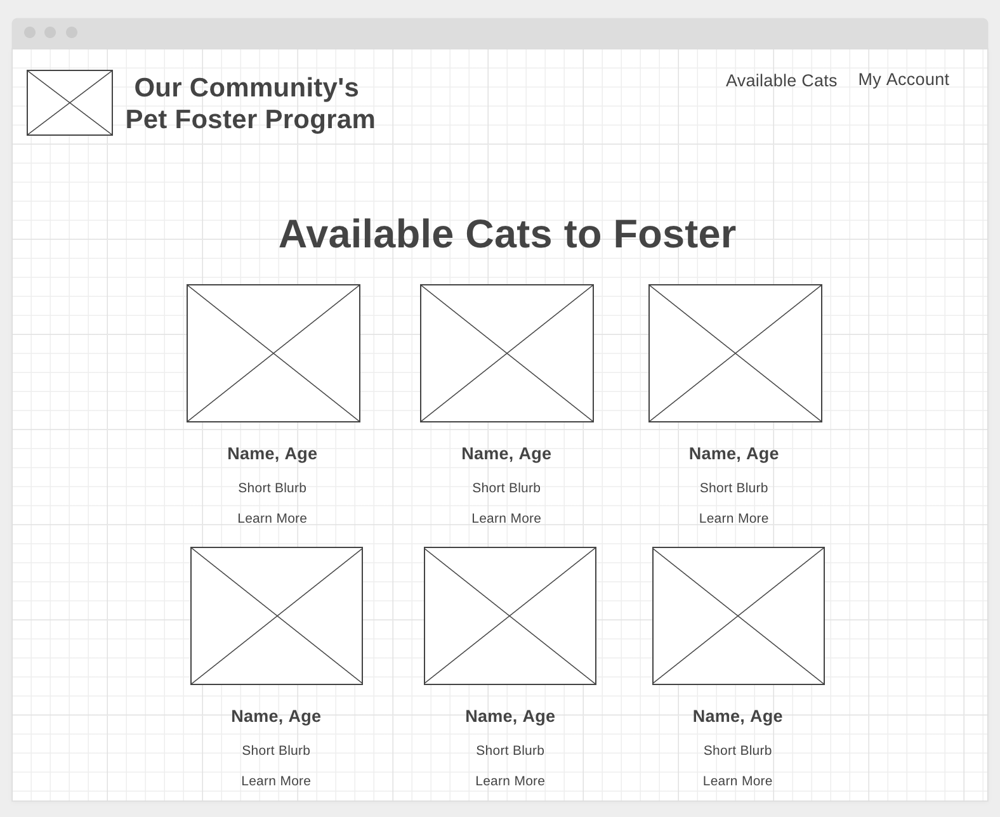
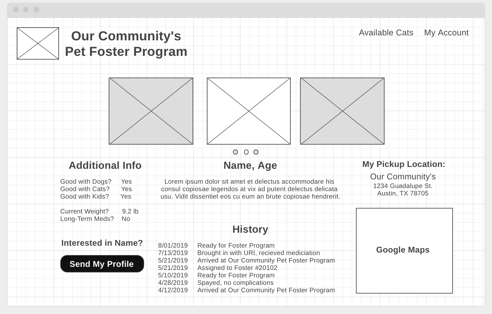
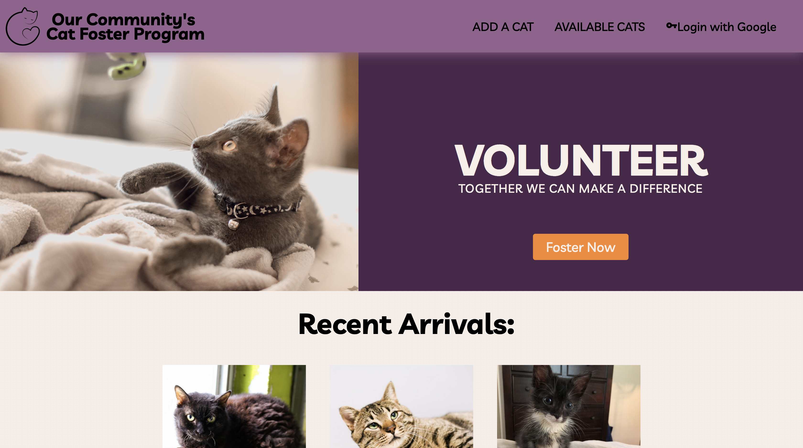
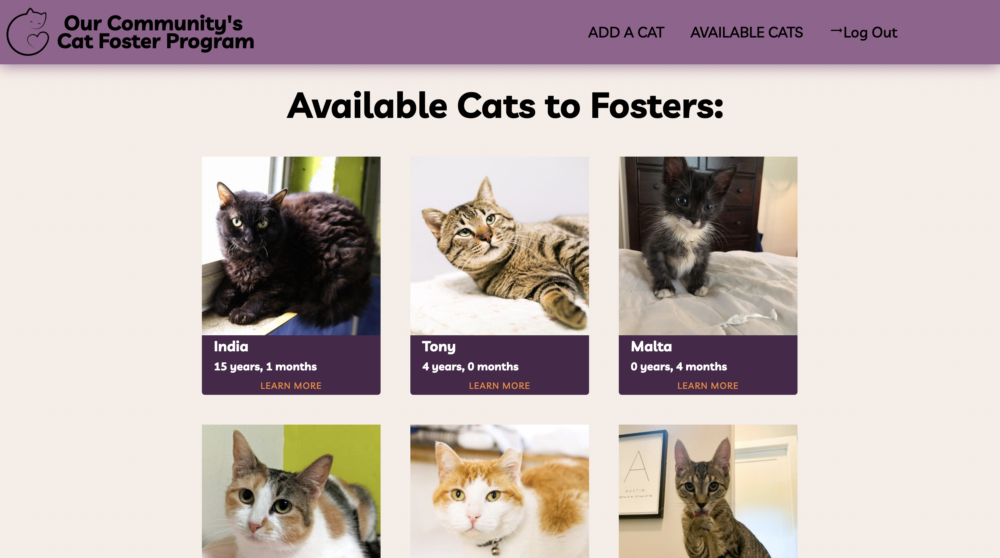
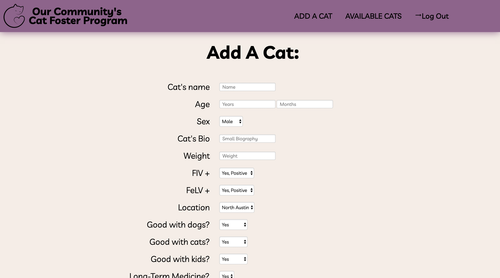

# **Cat Foster Database**
#### Created by Vittoria Erdem

### **Objective:**
* Create a database that allows a foster program to add cats in need of a foster home. 
* Registered fosters can view available cats and request to foster through the database. 

[Go now!](Heroku link)

### **Technology used:**
* HTML, CSS & JavaScript, Node, MongoDB, Mongoose

### **Wireframes:**

### **User Stories:**
As a visitor
* I want to view available cats 

As a registered foster
* I want to view available cat's details, including history, location, etc.
* I want to send my profile when I find a cat I'm interested in fostering

### **Features List:**
* Create - Cats can be added to the foster database.
* Read - Cat's profiles and details can be reviewed. 
* Delete - Cat's profile can be deleted, if needed. 

### **Stretch Goals:**
* Import -  Create individual cat care sheets with updated database info and foster's profile.
* Google Maps - Show real map locations with clickable links. 
* Expansion - Add Dogs to the database

### **Psuedocode:**
* Create a front page with sign-in and sign-up links
* Use Google Auth to log in to account
* Redirect signed in user to Available Cats page
* Show profile photos, name, age and small blurb on Available Cats page along with Learn More link 
* Clicking on Learn More redirects to details
* Cat's Details page shows all the available information and uses Google Maps API to show the cat's current location. 
* Clicking on Send My Profile sends user's info to the organization's foster dashboard. 

